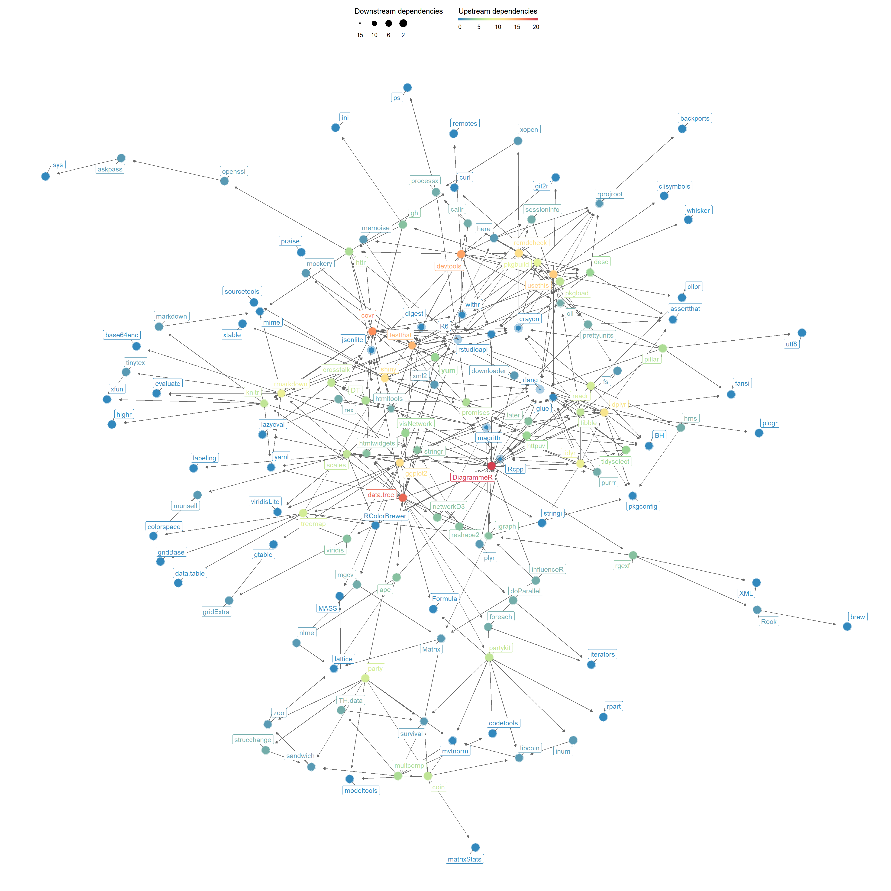

<!-- README.md is generated from README.Rmd. Please edit that file -->
yum 📦
=====

yum: YAML Utilities & More

The goal of `yum` is to provide a number of functions to work with files that contain one or more YAML fragments. Several packages (the [`rock`](https://rock.opens.science), [`dct`](https://dct.opens.science), and [`justifier`](https://justifier.opens.science) packages) leverage the YAML format to facilitate systematic encoding of information in a format that is both machine- and human-readable. The yum package provides a number of functions to facilitate this in a uniform manner with minimal dependencies (i.e. only `yaml`, suggesting `data.tree` to enable additional functionality).

[](https://gitlab.com/r-packages/yum/commits/master)

[](https://codecov.io/gl/r-packages/yum?branch=master)

Installation
------------

You can install the released version of `yum` from [CRAN](https://CRAN.R-project.org) with:

``` r
install.packages('yum');
```

You can install the development version of `yum` from [GitLab](https://gitlab.com) with:

``` r
devtools::install_gitlab('r-packages/yum');
```

(assuming you have `devtools` installed; otherwise, install that first using the `install.packages` function)

Dependencies
------------

`yum` was created to have minimal dependencies. It requires \[yaml::yaml\] to be able to actually load (parse) the extracted YAML fragments, and you will often want to have \[data.tree::data.tree\] available to organise the results in a tree if they have a hierarchical structure. Therefore, `yum` does have some dependencies through those two suggested packages. Of these, `yaml` only has one dependency, but `data.tree` has a few more. Specifically, the dependency network looks like this:


